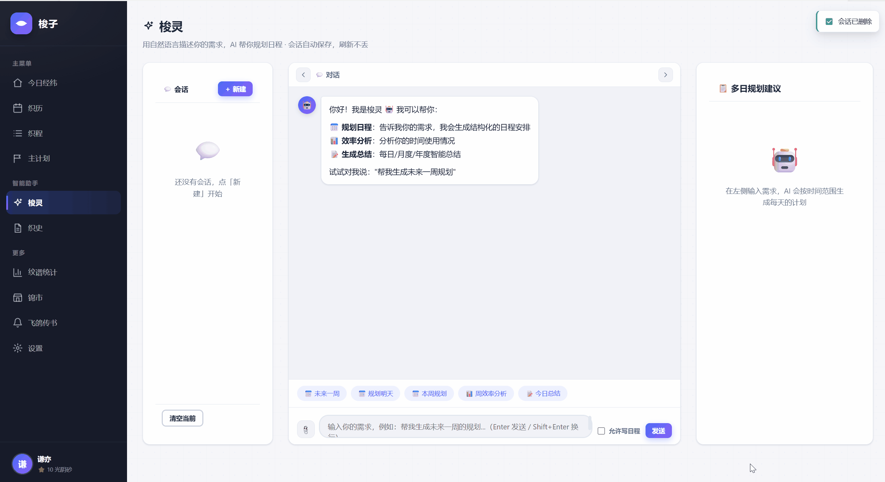
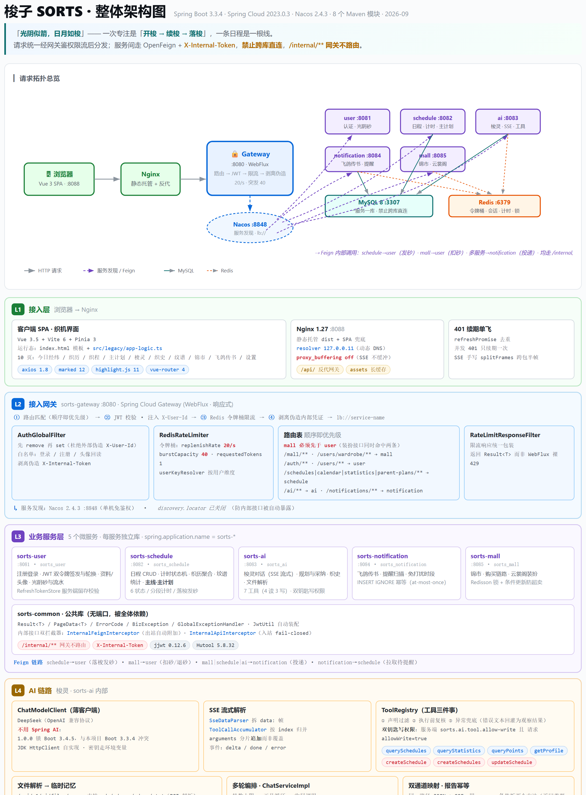

# 梭子 SORTS

> 专注计时与日程规划效率平台 · 主题「**光阴似箭，日月如梭**」

把时间当作织机：日程是经线，专注是纬线，一次「**开梭 → 穿梭 → 落梭**」就是一段被真实记录下来的专注。梭子（SORTS）围绕这条主线提供日程编排、穿梭计时、织历聚合、纹谱统计、AI 规划与锦市装扮。

### 演示



## 快速开始

| 依赖 | 说明 |
| --- | --- |
| Docker | Docker Desktop（WSL 2）或 WSL 内自建 dockerd |
| JDK 17 | 本地跑后端需要（勿用 23+，Lombok 兼容问题） |
| Node 22 | 本地跑前端需要 |

```bash
# 1. 启动中间件（MySQL / Redis / Nacos / RabbitMQ）
bash scripts/docker.sh up

# 2. 构建并启动 6 个后端服务（网关 8080）
bash scripts/docker.sh app

# 3. 启动前端站点（http://localhost:8088，Nginx 已反代 /api）
bash scripts/docker.sh web

# 状态一览 / 停止
bash scripts/docker.sh status
bash scripts/docker.sh app-down
```

- 首次启动自动从 `docker/.env.example` 生成 `docker/.env`；AI 服务需在 `.env` 配 `DEEPSEEK_API_KEY`（未配置不影响启动，AI 接口返回 503）
- 本地开发：`cd backend && ./mvnw clean install` 构建后端，`cd frontend/vite-app && npm install && npm run dev` 跑前端（vite proxy → 网关 8080）
- 端口：MySQL 3307 · Redis 6379 · Nacos 8848 · RabbitMQ 5672/15672 · 网关 8080 · **前端 8088**

## 架构

<p align="center">
  
  <br/>
  <em>整体架构图（点击图片查看原图）</em>
</p>

分层总览：L1 接入层（SPA + Nginx）→ L2 网关（路由 / JWT 鉴权 / 令牌桶限流 / 剥离伪造内部凭证）→ L3 业务服务层（5 微服务 + common）→ L4 AI 链路（梭灵）→ L5 数据与中间件 → L6 构建测试部署。可编辑源文件见 [`docs/assets/architecture.html`](docs/assets/architecture.html)。

| 服务 | 端口 | 独立库 | 职责 |
| --- | --- | --- | --- |
| **sorts-gateway** | 8080 | — | 统一入口：路由、鉴权、限流 |
| **sorts-user** | 8081 | `sorts_user` | 注册登录、双令牌、资料、光阴砂 |
| **sorts-schedule** | 8082 | `sorts_schedule` | 日程 CRUD、计时状态机、主计划、统计 |
| **sorts-ai** | 8083 | `sorts_ai` | 对话（SSE）、规划采纳、报告、工具调用 |
| **sorts-notification** | 8084 | `sorts_notification` | 通知、提醒设置、定时扫描幂等 |
| **sorts-mall** | 8085 | `sorts_mall` | 锦市、购买一致性、云裳阁 |
| **frontend** | 8088 | — | 主版前端（Vite 构建，Nginx 托管） |

## 技术栈

- **后端**：Spring Boot 3.3 · Spring Cloud 2023 · Nacos 2.4 · Gateway · OpenFeign · MyBatis-Plus · MySQL 8（每服务独立库）· Redis · RabbitMQ
- **AI**：DeepSeek（OpenAI 兼容协议）+ SSE 流式 + Tool Calling（4 读 3 写，双钥匙写权限）
- **前端**：Vue 3.5 + Vite 6（TypeScript 组件化源码存档），Nginx 托管构建产物
- **工程**：Maven Wrapper · Docker Compose 多阶段镜像 · GitHub Actions · JUnit 5 + Mockito + Vitest

## 文档

| 文档 | 用途 |
| --- | --- |
| [docs/PROJECT.md](docs/PROJECT.md) | **工程详情**：项目亮点、功能特性、API 一览、核心设计、测试与指标、Docker 部署、CI/CD、FAQ |
| [docs/PROGRESS.md](docs/PROGRESS.md) | 里程碑进度、关键决策、已知限制与技术债 |
| [docs/dev-setup.md](docs/dev-setup.md) | 环境准备、端口、构建命令、环境变量 |
| [docs/ide-setup.md](docs/ide-setup.md) | IDEA 导入、JDK 17、共享运行配置 |
| [docs/theme-design.md](docs/theme-design.md) | 主题规范「织锦流光」 |
| [api-spec.json](api-spec.json) | OpenAPI 契约（改接口前先对齐） |

## 许可证

基于 **MIT License** 开源，详见 [LICENSE](LICENSE)。
