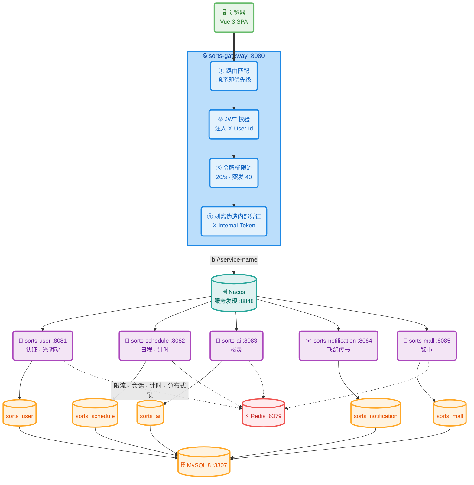

# 梭子 SORTS

> 专注计时与日程规划效率平台 · 主题「**光阴似箭，日月如梭**」

把时间当作织机：日程是经线，专注是纬线，一次「**开梭 → 穿梭 → 落梭**」就是一段被真实记录下来的专注。梭子（SORTS）围绕这条主线提供日程编排、穿梭计时、织历聚合、纹谱统计、AI 规划与锦市装扮。

技术栈：基于 **Spring Boot 3 + Spring Cloud + Nacos** 微服务架构，辅以 **Vue 3** 单页应用（主版静态托管）与 **DeepSeek** 驱动的 AI 助手「**梭灵**」。全部能力统一由网关鉴权限流后分发，服务间通过 OpenFeign 与内部凭证调用，**禁止跨库直连**。

## 项目亮点

- **专注计时状态机**：五态流转（开梭 → 暂停 → 续梭 → 落梭 → 取消）显式声明合法前驱，非法跃迁返回 409——专注秒数是光阴砂与统计的唯一数据源，必须由服务端裁定。落梭在事务内结算秒数并原子发放光阴砂，奖励失败仅告警、不回滚主流程。
- **激励闭环一致性**：光阴砂仅由真实专注产出；兑换走「Redisson 加锁 → 扣砂 → 事务落库 → 失败退砂」固定顺序，锁内重加载防排队期间状态漂移，库存用 `UPDATE ... WHERE stock > 0` 条件更新兜底——激励一旦可刷，专注数据即刻失真，宁可拒绝也不多发。
- **梭灵可读可写日程**：DeepSeek + SSE 流式 + Tool Calling 六工具；写工具须「服务端开关 + 用户单次授权」双钥匙同时到位；前端 `splitFrames` 拼接跨 TCP 包半帧。用户拿到的不是聊天框，是能落库的日程。
- **提醒投递 at-most-once**：`INSERT IGNORE` 抢占 `t_reminder_log` 唯一键，一次原子写同时完成判重与占位。提醒过期即无价值，宁可漏一次也不重复轰炸。

## 功能特性

- **日程编排**：支持单条与批量创建，含标题、描述、计划时长、优先级、标签、起止时间与提醒提前量；提供待办 / 进行中 / 已完成 / 已取消全生命周期
- **穿梭计时（状态机）**：`开梭 → 暂停 → 续梭 → 落梭 → 取消` 五态流转，中途暂停不丢时长；落梭时结算实际专注秒数并自动发放「光阴砂」；**未到计划开始时间禁止开梭**（前端按钮禁用 + 后端服务端时间双重校验，错误码 41010），状态变更记录操作人
- **织历视图**：按日 / 周聚合日程与专注记录，**自定义弹层月份选择器**（年份 ◀/▶ 预览、选定月份才跳转，避免随箭头跳动）与今日概览，直接反映「哪一天织得密」；**任务点调色板**——柔和自然色系（紧急度：珊瑚 / 蜜杏 / 淡蓝 / 鼠尾草绿；用户自定义色优先），每个日期格子以**圆形渐变画布**铺满：每种颜色一个随机落点的颜料点（互斥分区不重叠），圆形扩散半径随任务数量占比增大，多层半透明叠加实现颜色渐变过渡；**点击任意日期跳转织程并携带 date 参数**，自动按该日期闭区间筛选；日历读独立**全量日程列表**，不受织程日期筛选影响
- **主线 · 主计划（长时间计划容器）**：主计划可挂载多个子计划（现有日程），进度随子计划完成自动聚合；主页**盒子模型**——子任务内嵌在主计划气泡内部（按计划时间排序：≤3 完整行 / ≤8 压缩行 / >8 按颜色任务点），不再是并列气泡；主计划独立状态流转（开始 / 暂停 / 续梭 / 完成）
- **纹谱统计**：汇总专注总时长、完成率、标签分布与趋势曲线，日 / 周 / 月多粒度切换，全部以秒为对外口径
- **梭灵（AI 助手）**：
  - 自然语言对话（SSE 流式打字机效果，支持多轮上下文，上下文存 Redis 12 小时）
  - 日程规划与一键采纳：**服务端注入当前时间解析相对日期**（未来一周 / 下周 / 本周 / 本月 / 今天 / 明天），按天生成多日计划（如「帮我生成未来一周规划」→ 今天起 7 天逐日 2-5 条，不堆在一天），前端按日分组展示、支持按项 / 按天 / 全选勾选与行内编辑，批量采纳后落库并刷新织程与织历；**同规划幂等**，重复采纳直接拒绝
  - **会话持久化**：登录用户会话全量快照存后端（消息上限 100 条、单条正文 5000 字符截断、上限 50 个自动软删最旧），刷新页面后会话列表 / 当前会话 / 消息 / 多日规划 / 勾选状态完整恢复
  - 日 / 月 / 年总结报告：异步生成，支持历史报告列表、详情查看与**单条 / 批量删除**；**同周期幂等**——同一月份 / 年度重复点击复用已有报告，不再重复调用模型（`force=true` 可强制刷新）
  - **今日总结一键入织史**：对话输入「生成今日总结」等意图即命中总结分支，自动生成当日总结（基于真实日程明细与统计）并在输出完成后**自动写入织史**，侧栏织史列表实时刷新，无需手工复制
  - 工具调用（Tool Calling）：`QuerySchedules` / `QueryStatistics` / `QueryPoints` / `GetProfile` / `CreateSchedule` / `CreateSchedules` 六种工具
  - **写操作双钥匙**：服务端开关 `sorts.ai.tool.allow-write` **且** 单次请求 `allowWrite=true`（前端需用户确认后置位），两把都到位才会下发并执行写工具
- **光阴砂与锦市**：落梭、完成任务获取光阴砂；锦市购买装扮采用「加锁 → 扣光阴砂 → 本地事务落库」顺序，库存扣减走 `UPDATE ... WHERE stock > 0` 条件更新兜底，保证奖励发放一致性
- **云裳阁**：已购装扮入仓库，可随时切换当前启用项，装扮数据与用户资料联动
- **飞鸽传书（通知）**：站内通知列表、已读 / 全部已读；提醒设置支持提前量、渠道与免打扰时段；定时扫描按 `t_reminder_log` 唯一键幂等去重，绝不重复轰炸
- **双令牌鉴权**：网关统一校验 JWT 并注入 `X-User-Id`，access 30 分钟 + refresh 7 天；前端 401 时单飞续期后自动重放原请求，用户无感
- **网关限流**：Redis 令牌桶（默认 20/秒、突发 40），登录态按用户、未登录按 IP 计数；网关同时剥离外部伪造的内部凭证头
- **现代化前端**：Vue 3 + Vite 构建主版前端（模板保留在 `index.html`，逻辑在 `src/legacy/app-logic.ts`，marked + highlight.js 已本地化），Nginx 托管构建产物，直连 `/api/v1` 真实接口，覆盖全部功能域：
  - 品牌与 favicon：左上角「织梭」SVG 品牌图标（渐变底），16/32/64 三档 PNG favicon
  - 织程：单条创建 / 编辑 / **单条与批量删除（事务 + 软删除 + 删除前确认）**，状态 / 优先级 / 关键词筛选，**日期范围查询**（今天 / 明天 / 本周 / 本月 / 自定义预设，起止日期闭区间，结果按日分组展示）
  - 织史：日 / 月 / 年总结报告，异步轮询查看（同周期幂等），**支持单条 / 批量删除**
  - 穿梭计时：开梭 → 暂停 → 续梭 → 落梭 → 取消五态流转，落梭实时结算并更新光阴砂；**未到计划开始时间的日程开梭按钮禁用并提示**
  - **全局穿梭气泡**：开梭 / 续梭进行中时，切换任意页面均在视口顶部置顶小气泡（任务名 + 已进行时长 + 暂停 / 落梭 / 取消按钮 + 呼吸光晕动画，`prefers-reduced-motion` 降级），**气泡背景跟随任务点颜色动态渐变**（自定义色优先、紧急度色兜底，135° 渐变风格不变），点击气泡空白处一键跳回今日经纬；**回到今日经纬时气泡自动隐藏**（主面板已有完整计时面板，不重复）；暂停期间不计时，续梭后时长平滑续接不跳变
  - **即将到来点击详情**：今日经纬「即将到来」日程卡片可点击，弹出日程详情（状态 / 优先级 / 描述 / 计划时间 / 预计时长 / 标签 + 开梭 / 取消 / 编辑）
  - 织历：月视图按日聚合色点（**自定义颜色优先、否则按紧急度分色**：URGENT 红 / HIGH 琥珀 / MEDIUM 蓝 / LOW 灰），**月份下拉快速切换**（近 5 年），选中日查看日程，今日概览；**点击日期跳转织程并自动筛选该日**；日历读独立**全量日程列表**（与织程筛选列表解耦，新建 / 编辑 / 删除 / AI 采纳后自动同步，修复筛选后圆点丢失需刷新的问题）
  - 纹谱统计：周汇总（完成率 / 专注时长 / 连续天数）、7 日趋势、标签时间分布
  - 梭灵：自然语言对话（JSON 模式）、**多日规划按天勾选 / 编辑 / 批量采纳**、**会话自动保存（刷新不丢）**
  - 锦市与云裳阁：分类浏览、购买确认、光阴砂实时更新、装扮启用切换；**7 款主题皮肤**（织锦流光 / 星夜梭影 / 沧浪青岚 / 霞光织锦 / 竹影幽篁 / 墨韵流年 / 樱色入梦）
  - 飞鸽传书：通知列表、单条已读 / 全部已读、提醒设置
  - **统一提示窗**：成功 / 警告 / 错误弹窗与轻提示，错误窗含标题、摘要、详情折叠、复制与关闭（生产环境不暴露堆栈）；请求超时 / 网络 / 业务 / 权限错误统一接管
  - **刷新保持**：hash 路由 + sessionStorage 恢复当前页面与关键状态（织程筛选与选中项、织历月份与选中日、织史选中项、AI 当前会话），刷新不跳回首页
  - 双令牌无感续期：401 自动刷新并重放原请求
- **全栈容器化**：中间件、6 个后端服务与前端站点统一由 `docker/compose.yml` 编排，`scripts/docker.sh` 一个入口管理，宿主不装 JDK / Node 也能跑

## 技术栈

| 层次      | 技术                                                                          |
| ------- | --------------------------------------------------------------------------- |
| 语言/运行环境 | Java 17（编译目标 17）、Node 22                                                    |
| 后端框架    | Spring Boot 3.3.4 / Spring Cloud 2023.0.3 / Spring Cloud Alibaba 2023.0.3.2 |
| 服务注册与发现 | Nacos 2.4.3（单机模式，Docker 部署）                                                 |
| 网关      | Spring Cloud Gateway（WebFlux）：路由转发 + JWT 鉴权 + Redis 令牌桶限流                   |
| 服务间调用   | OpenFeign + 负载均衡，内部接口统一 `/internal/**` + `X-Internal-Token`                 |
| 持久层     | MyBatis-Plus 3.5.7 + MySQL 8（每服务独立库，禁止跨库直连）                                 |
| 缓存      | Redis（redis-stack 镜像 6379：Redis 本体 + RediSearch/RedisJSON 模块）               |
| 消息中间件   | RabbitMQ 3.13（当前提醒走 `@Scheduled`，MQ 为事务性消息 / outbox 技术债预留）                  |
| AI 模型   | DeepSeek（OpenAI 兼容协议），自实现薄客户端封装在 `ChatModelClient` 接口后                      |
| 认证      | JWT（access 30 分钟 / refresh 7 天）+ BCrypt 密码哈希                                |
| 前端      | Vue 3.5 + Vite 6 构建主版（`frontend/vite-app/`：模板 index.html + 逻辑 src/legacy/），Nginx 托管 dist；TypeScript + Pinia 组件化源码保留于 src/（后续渐进替换 legacy） |
| 测试      | JUnit 5 + Mockito（后端）、Vitest（前端）                                            |
| 构建与运维   | Maven Wrapper、Docker Compose 多阶段镜像、GitHub Actions、Nginx（前端静态托管 + `/api` 反代） |

## 系统架构

### 请求链路



> 服务间横向调用一律走 OpenFeign + `/internal/**`，网关**不路由**该前缀，因此内部接口对外网络根本不可达。

### 模块说明

| 服务                     | 端口          | 独立库                  | 职责                                               |
| ---------------------- | ----------- | -------------------- | ------------------------------------------------ |
| **sorts-gateway**      | 8080        | —                    | 统一入口：路由转发、JWT 鉴权、令牌桶限流、剥离伪造内部凭证                  |
| **sorts-user**         | 8081        | `sorts_user`         | 注册登录、双令牌签发与续期、资料维护、头像、光阴砂与流水                   |
| **sorts-schedule**     | 8082        | `sorts_schedule`     | 日程 CRUD、计时状态机、日历聚合、纹谱统计、落梭发放积分                   |
| **sorts-ai**           | 8083        | `sorts_ai`           | 对话（SSE 流式）、日程规划与采纳、日/月/年报告、工具调用编排                |
| **sorts-notification** | 8084        | `sorts_notification` | 通知列表与已读、提醒设置、定时提醒扫描与幂等去重                         |
| **sorts-mall**         | 8085        | `sorts_mall`         | 锦市商品、购买（加锁 + 条件更新一致性兜底）、云裳阁仓库与启用切换                  |
| **frontend**           | 8088        | —                    | 主版前端（Vite 构建产物；Nginx 托管并反代 `/api`；多阶段镜像内构建） |

### 网关路由

| 前缀                                                                   | 目标服务               | 说明                                   |
| -------------------------------------------------------------------- | ------------------ | ------------------------------------ |
| `/api/v1/mall/**`、`/api/v1/users/wardrobe/**`                        | sorts-mall         | **必须排在 user 之前**：装扮接口同时命中两条路由，顺序即优先级 |
| `/api/v1/auth/**`、`/api/v1/users/**`                                 | sorts-user         | 认证与用户资料                              |
| `/api/v1/schedules/**`、`/api/v1/calendar/**`、`/api/v1/statistics/**` | sorts-schedule     | 日程、日历与统计                             |
| `/api/v1/ai/**`                                                      | sorts-ai           | AI 对话、规划与报告                          |
| `/api/v1/notifications/**`                                           | sorts-notification | 通知与提醒设置                              |

> 已关闭 `discovery.locator` 自动路由，避免后端内部接口被意外暴露。

### 数据分布

| 库                    | 主要表                                                    |
| -------------------- | ------------------------------------------------------ |
| `sorts_user`         | `t_user`、`t_points_log`                                |
| `sorts_schedule`     | `t_schedule`、`t_time_record`                           |
| `sorts_ai`           | `t_schedule_plan`（AI 生成的规划）、`t_ai_report`              |
| `sorts_notification` | `t_notification`、`t_reminder_setting`、`t_reminder_log` |
| `sorts_mall`         | `t_mall_item`、`t_purchase_record`、`t_wardrobe_item`    |

建库建表脚本位于 `scripts/sql/`，首次创建 MySQL 数据卷时按文件名顺序自动执行（`00-init-databases.sql` 在最前）。

## 目录结构

```
.
├── README.md                 # 本文档
├── api-spec.json             # OpenAPI 契约（改接口前先对齐）
├── docker/                   # 容器编排（唯一入口）
│   ├── compose.yml           # 中间件 + 6 个服务 + 前端（profile 区分）
│   ├── Dockerfile.backend    # 服务通用镜像（多阶段：Maven → JRE，按 ARG MODULE 复用）
│   ├── Dockerfile.frontend   # 前端镜像（静态页 → Nginx，免构建）
│   ├── nginx.conf            # SPA 兜底 + /api 反代（含 SSE 关闭缓冲）
│   └── .env.example          # 端口/口令模板（复制为 .env 使用，不入库）
├── backend/                  # Maven 多模块工程
│   ├── mvnw / mvnw.cmd       # Maven Wrapper（IDE / CI 无需预装 Maven）
│   ├── sorts-common/         # Result / 异常 / JWT / PageData / 内部凭证拦截器
│   ├── sorts-gateway/        # 网关：路由、鉴权过滤器、限流
│   ├── sorts-user/           # 用户服务
│   ├── sorts-schedule/       # 日程服务（含计时、日历、统计）
│   ├── sorts-ai/             # AI 服务（llm / tool / service / controller）
│   ├── sorts-notification/   # 通知服务
│   └── sorts-mall/           # 锦市服务
├── frontend/                 # 前端工程（Vue 3 + Vite 构建，主版）
│   └── vite-app/             # Vite 6 工程：index.html（页面模板）+ src/legacy/（主版逻辑与样式）+ 组件化源码存档
│       ├── src/legacy/       # 主版数据层 app-logic.ts + style.css + github.min.css（由 js/app.js 迁入）
│       └── src/views|components|stores|api  # 组件化重构源码存档（渐进替换 legacy 用）
├── docs/
│   ├── PROGRESS.md           # 里程碑进度、关键决策、已知限制与技术债
│   ├── dev-setup.md          # 开发手册（端口、命令、环境变量、约定）
│   ├── ide-setup.md          # IDEA 运行手册（Maven 导入、JDK 17、报错速查）
│   └── theme-design.md       # 主题规范「织锦流光」
├── scripts/
│   ├── docker.sh             # 容器统一入口（up/app/web/status/logs/sql/keepalive/shell/clean…）
│   ├── mvn.sh                # AI 沙箱内的构建封装
│   ├── wsl-middleware.sh     # 兼容层，内部转发到 docker.sh
│   └── sql/                  # 建库建表 + 种子数据（首次启动自动执行）
├── .run/                     # IDEA 共享运行配置（6 服务 + Compound）
└── .github/workflows/ci.yml  # CI：后端全量测试 + 前端构建测试 + 6 服务矩阵镜像
```

## 快速开始

### 环境要求

| 依赖      | 版本 / 说明                                                                                |
| ------- | -------------------------------------------------------------------------------------- |
| Docker  | Docker Desktop（WSL 2 后端）或 WSL 内自建 dockerd；`scripts/docker.sh` 会自动识别用哪条通路               |
| JDK 17  | 本地跑后端需要。**IDEA 里必须选 JDK 17（本机注册名 `ms-17`），勿用 23+**：Lombok 1.18.34 对高版本 JDK 支持不完整，编译期会崩 |
| Node 22 | 本地跑前端需要                                                                                |
| Git     | 推荐 Git Bash；仓库远端名为 `sorts`                                                             |

### 1. 启动中间件

```bash
# WSL 或 Git Bash 内执行（首次会自动从 .env.example 生成 docker/.env）
bash scripts/docker.sh up

bash scripts/docker.sh status        # 端口 + 容器 + 数据库一览
bash scripts/docker.sh sql           # 新增建表脚本后补执行
bash scripts/docker.sh logs mysql    # 跟踪日志
bash scripts/docker.sh down          # 停止（数据保留在命名卷）
```

等价于 `docker compose -f docker/compose.yml up -d`，会拉起 MySQL 3307、Redis 6379、Nacos 8848、RabbitMQ 5672，并在 MySQL 首次初始化数据卷时自动执行 `scripts/sql/*.sql`。

> **WSL 内自建 dockerd 时注意**：WSL 会在最后一个终端会话结束后回收发行版，dockerd 与容器随之中止，下次执行任何命令会冷启动（容器靠 `restart: unless-stopped` 自动恢复，健康检查重跑）。需要容器长时间在线时另开一个窗口执行 `bash scripts/docker.sh keepalive`。
> `%USERPROFILE%\.wslconfig` 的 `[wsl2] vmIdleTimeout` 只控制 **VM** 热态，**不能**阻止发行版被回收——别指望它替代 keepalive。

### 2. 配置环境变量

```bash
cp docker/.env.example docker/.env    # 如尚未自动生成
```

| 变量                                    | 默认值                        | 说明                                |
| ------------------------------------- | -------------------------- | --------------------------------- |
| `MYSQL_PORT` / `MYSQL_ROOT_PASSWORD`  | `3307` / `sorts_dev`       | MySQL 宿主端口与 root 口令               |
| `REDIS_PORT` / `REDIS_PASSWORD`       | `6379` / `sorts_dev`       | Redis 端口与口令                       |
| `RABBITMQ_USER` / `RABBITMQ_PASSWORD` | `sorts` / `sorts_dev`      | RabbitMQ 账号                       |
| `GATEWAY_PORT` / `FRONTEND_PORT`      | `8080` / `8088`            | 网关与前端宿主端口                         |
| `INTERNAL_TOKEN`                      | `sorts-internal-dev-token` | 服务间凭证，**各服务必须一致**，生产用环境变量注入       |
| `JWT_SECRET`                          | 开发默认值                      | JWT 签名密钥，生产必须覆盖                   |
| `DEEPSEEK_API_KEY`                    | 空                          | AI 服务必填；未配置时 AI 接口返回 503 提示，不影响启动 |

> 仓库内不留任何密钥，`docker/.env` 不入库。服务侧还可覆盖 `MYSQL_HOST/PORT/USER/PASSWORD`、`REDIS_HOST/PORT/PASSWORD`、`NACOS_ADDR`、`NACOS_ENABLED`。

### 3. 启动后端（本地进程，推荐日常开发）

```bash
cd backend && ./mvnw clean install   # 构建全模块并跑单测
cd backend && ./mvnw test            # 只跑单测
cd backend && ./mvnw -pl sorts-gateway spring-boot:run
```

随后用 `.run/` 里的共享配置逐个启动服务（详见 [docs/ide-setup.md](docs/ide-setup.md)）。启动顺序：中间件 → user → schedule / ai / notification / mall → gateway。

> 沙箱内构建请用 `bash scripts/mvn.sh`：环境注入了 `MSYS_NO_PATHCONV=1`，POSIX 路径不会被转成 Windows 路径，直接跑 `mvn` 会报 `ClassNotFoundException: classworlds.launcher.Launcher`。

### 4. 启动前端

主版前端为 **Vite 工程**（`frontend/vite-app/`），容器镜像内多阶段构建，宿主无需 Node：

```bash
bash scripts/docker.sh web        # 容器方式：http://localhost:8088（Nginx 已反代 /api 到网关，镜像内 npm run build）
```

本地开发调试：

```bash
cd frontend/vite-app && npm install && npm run dev   # http://localhost:5173（vite proxy /api → 网关 8080）
cd frontend/vite-app && npm run build                # 生产构建到 dist/（Dockerfile 多阶段复用）
```

### 5. 全容器化运行（宿主不装 JDK / Node 也能跑）

```bash
bash scripts/docker.sh up        # 中间件
bash scripts/docker.sh app       # 构建并启动 6 个服务（网关 8080）
bash scripts/docker.sh web       # 可选：前端站点 8088（Nginx 反代 /api）
bash scripts/docker.sh keepalive # 可选：占住 WSL 会话，避免发行版被回收导致容器一起停
bash scripts/docker.sh app-down  # 停服务
```

服务镜像为多阶段构建（`docker/Dockerfile.backend`，按 `MODULE` 参数复用同一份 Dockerfile），容器内通过服务名互访（`mysql` / `redis` / `nacos`），不依赖宿主机端口映射。

### 端口与默认账号

| 资源           | 地址                                      | 账号                                      |
| ------------ | --------------------------------------- | --------------------------------------- |
| MySQL        | localhost:**3307**                      | root / `sorts_dev`                      |
| Redis        | localhost:**6379**                      | 密码 `sorts_dev`                          |
| Nacos        | http://localhost:8848/nacos             | 单机免鉴权                                   |
| RabbitMQ     | localhost:5672 / http://localhost:15672 | sorts / `sorts_dev`                     |
| 网关           | http://localhost:8080                   | 需 `Authorization: Bearer <accessToken>` |
| 前端（容器） | http://localhost:**8088** | — |

## API 接口一览

> 完整契约见 [api-spec.json](api-spec.json)；与实现之间的已知偏差记录在 [docs/PROGRESS.md](docs/PROGRESS.md) 决策记录中。

### 认证

| 方法   | 路径                      | 说明                        |
| ---- | ----------------------- | ------------------------- |
| POST | `/api/v1/auth/register` | 用户注册                      |
| POST | `/api/v1/auth/login`    | 用户登录（返回 access / refresh） |
| POST | `/api/v1/auth/refresh`  | 刷新令牌                      |
| POST | `/api/v1/auth/logout`   | 退出登录                      |

### 用户与积分

| 方法      | 路径                            | 说明                                                 |
| ------- | ----------------------------- | -------------------------------------------------- |
| GET/PUT | `/api/v1/users/me`            | 获取 / 更新当前用户信息                                      |
| POST    | `/api/v1/users/avatar/upload` | 上传头像（鉴权 + multipart；2MB 上限，PNG/JPG/GIF/WebP；返回 UserVO，URL 前缀 `/api/v1/users/avatar/files/`） |
| GET     | `/api/v1/users/avatar/files/{filename}` | 头像静态读取（网关白名单免鉴权；扩展名映射 Content-Type，Cache-Control 7 天） |
| PUT     | `/api/v1/users/me/password`   | 修改密码                                               |
| GET     | `/api/v1/users/points`        | 查询光阴砂余额及流水                                         |
| POST    | `/api/v1/users/points/change` | 变更光阴砂（**内部调用**；正数增、负数减，与 api-spec 已对齐） |

### 日程与计时

| 方法             | 路径                              | 说明           |
| -------------- | ------------------------------- | ------------ |
| POST/GET       | `/api/v1/schedules`             | 创建 / 查询日程    |
| GET/PUT/DELETE | `/api/v1/schedules/{id}`        | 详情 / 更新 / 删除 |
| POST           | `/api/v1/schedules/{id}/start`  | 开梭（开始计时；未到计划开始时间返回 41010） |
| POST           | `/api/v1/schedules/{id}/pause`  | 暂停计时         |
| POST           | `/api/v1/schedules/{id}/resume` | 续梭（恢复计时）     |
| POST           | `/api/v1/schedules/{id}/end`    | 落梭（结束并结算）    |
| POST           | `/api/v1/schedules/{id}/cancel` | 取消日程         |
| GET            | `/api/v1/schedules/active`      | 获取当前进行中的日程   |
| POST           | `/api/v1/schedules/batch`       | 批量创建日程       |
| GET            | `/api/v1/schedules`             | 日程列表（`date=YYYY-MM-DD` 单日 / `startDate&endDate` 闭区间查询） |
| DELETE         | `/api/v1/schedules/{id}`        | 单条删除（软删除）    |
| POST           | `/api/v1/schedules/batch-delete` | 批量删除（事务，整体成功或整体回滚） |

### 日历与统计

| 方法  | 路径                           | 说明        |
| --- | ---------------------------- | --------- |
| GET | `/api/v1/calendar`           | 日历视图数据（月） |
| GET | `/api/v1/calendar/week`      | 周视图       |
| GET | `/api/v1/calendar/today`     | 今日概览      |
| GET | `/api/v1/statistics/summary` | 统计汇总      |
| GET | `/api/v1/statistics/trend`   | 趋势数据      |
| GET | `/api/v1/statistics/tags`    | 标签统计      |

### 梭灵（AI 接口）

| 方法   | 路径                               | 说明                                      |
| ---- | -------------------------------- | --------------------------------------- |
| POST | `/api/v1/ai/chat`                | AI 对话（默认 SSE 流式，`?stream=false` 走 JSON） |
| POST | `/api/v1/ai/plan`                | 生成日程规划（默认 JSON，`?stream=true` 走 SSE）；**服务端注入当前时间，支持未来一周 / 下周 / 本周 / 本月等相对范围多日规划**，响应含 `range` 与逐条 `date` |
| POST | `/api/v1/ai/plan/{planId}/adopt` | 采纳 AI 规划，批量落库（**同规划幂等**；支持 `overrides` 逐条编辑覆盖） |
| POST | `/api/v1/ai/summary/daily`       | 生成每日总结                                  |
| POST | `/api/v1/ai/summary/monthly`     | 生成月度总结                                  |
| POST | `/api/v1/ai/summary/yearly`      | 生成年度总结                                  |
| GET  | `/api/v1/ai/reports`             | 历史报告列表                                  |
| GET  | `/api/v1/ai/reports/{id}`        | 报告详情                                    |
| DELETE | `/api/v1/ai/reports/{id}`      | 删除织史（软删除）                              |
| POST | `/api/v1/ai/reports/batch-delete` | 批量删除织史（事务）                            |
| GET/POST | `/api/v1/ai/conversations`   | 会话列表 / 新建会话                             |
| GET/PUT/DELETE | `/api/v1/ai/conversations/{id}` | 会话详情 / 全量快照保存 / 删除（软删除）        |
| POST | `/api/v1/ai/conversations/batch-delete` | 批量删除会话（事务）                      |

### 通知

| 方法      | 路径                                | 说明          |
| ------- | --------------------------------- | ----------- |
| GET     | `/api/v1/notifications`           | 通知列表        |
| PUT     | `/api/v1/notifications/{id}/read` | 标记单条已读      |
| PUT     | `/api/v1/notifications/read-all`  | 全部标记已读      |
| GET/PUT | `/api/v1/notifications/settings`  | 获取 / 更新提醒设置 |

### 锦市与云裳阁

| 方法   | 路径                              | 说明             |
| ---- | ------------------------------- | -------------- |
| GET  | `/api/v1/mall/items`            | 商品列表           |
| GET  | `/api/v1/mall/items/{id}`       | 商品详情           |
| POST | `/api/v1/mall/purchase`         | 购买商品           |
| GET  | `/api/v1/users/wardrobe`        | 云裳阁装扮仓库（路由指向锦市服务） |
| PUT  | `/api/v1/users/wardrobe/active` | 切换当前启用装扮       |

### 接口与数据约定（前后端都要守）

1. **统一响应体** `Result<T>`：`{ code, message, data, timestamp }`，**`code = 0` 表示成功**。
2. **分页字段是 `list`**：`PageData<T> = { list, total, page, pageSize }`。
3. **时长口径**：日程与统计对外一律「秒」（`actualDuration`、`totalFocusTime`…），唯一例外是 `plannedDuration`（分钟）。
4. **鉴权**：网关校验 JWT 后注入 `X-User-Id`，业务服务只读该头；前端持有 `accessToken` / `refreshToken`，401 时单飞续期后重放。
5. **内部接口**：一律 `/internal/**`（网关不路由该前缀）并标 `@InternalApi`；出站凭证由 common 的 Feign 拦截器按路径白名单自动附加，新增路径要同步 `sorts.internal.paths`。
6. **AI 流式**：传输方式由 **query 参数**决定（`stream=true/false`）；SSE 事件为 `delta` / `done` / `error`。
7. **AI 写操作是双钥匙**：服务端 `sorts.ai.tool.allow-write` **且** 请求体 `allowWrite=true`（前端需用户确认后置位）。

## 核心设计说明

### 计时状态机

日程计时在 `sorts-schedule` 中以显式状态流转，非法跃迁直接拒绝：

```
创建 ──开梭──► 进行中 ──暂停──► 已暂停 ──续梭──► 进行中
                 │                              │
                 └──────── 落梭 ────────────────┘
                            │
                            ▼
                      已完成（结算 actualDuration 并发积分）
任意非终态 ──取消──► 已取消
```

- 暂停期间不计入时长，恢复时以新的 `actualStartTime` 重新起算，已累计秒数保留在 `actualDuration`
- 落梭为终态：一次性结算实际专注秒数，并通过 Feign 调用用户服务发放光阴砂
- 前端计时器在页面刷新后按 `actualDuration + (now - actualStartTime)` 自愈，不依赖本地计时

### AI 工具调用与双钥匙写权限

`ToolRegistry` 承担三件事：**声明过滤**（决定把哪些工具下发给模型）、**执行前复核**（校验参数与权限）、**异常兜底**（工具抛错转成可读结果回灌模型，不中断对话）。

- 读工具：`QuerySchedules` / `QueryStatistics` / `QueryPoints` / `GetProfile`
- 写工具：`CreateSchedule` / `CreateSchedules`
- **双钥匙**：服务端配置 `sorts.ai.tool.allow-write` 打开总闸；单次请求 `allowWrite=true` 表示用户本次授权。任一缺失，写工具根本不会出现在下发给模型的工具列表里
- 回灌模型的 JSON 一律走 `ToolJsonCodec`（时间固定 ISO-8601），不使用全局 `ObjectMapper`
- OpenAI 兼容协议的流式 `tool_calls` 必须按 `index` **追加** `arguments` 分片，否则模型收到的是残缺 JSON

### SSE 流式与前后端约定

`EventSource` 不支持 POST 与自定义鉴权头，前端改用 `fetch + ReadableStream` 自行解析：

- `splitFrames` 处理「一包多帧 / 跨包半帧 / `\r\n` 兼容」三种情况
- 事件类型：`delta`（文本增量）、`done`（结束）、`error`（`{code,message}`）
- 用户主动取消时 `abort`，静默结束不抛错
- 后端同一路径要同时支持 JSON 与 SSE 时，用 `params` 条件拆成两个处理方法，**返回类型不能写 `Object`**——Spring MVC 按声明类型选处理器，`SseEmitter` 会被 Jackson 序列化

### 服务间内部调用

- 内部接口路径统一 `/internal/**`，网关不路由，外部不可达
- 出站请求由 common 的 Feign 拦截器按路径白名单自动附加 `X-Internal-Token`；新增内部路径必须同步 `sorts.internal.paths`
- 入站由 `InternalApiInterceptor` 校验，配合 `@InternalApi` 注解（编译期可见，改名不会静默失去保护）
- 未配置 `INTERNAL_TOKEN` 时内部接口 **fail-closed**（拒绝而非放行）

### 购买一致性

顺序**不可颠倒**：

1. Redisson 按商品加锁（等待 3 秒、租期 10 秒）
2. 调用用户服务扣减光阴砂（最常见失败，放在占库存之前以便快速失败）
3. 本地事务落库 + 条件更新扣库存 `UPDATE t_mall_item SET stock = stock - 1 WHERE id = ? AND stock > 0`

锁因租期失效时，数据库的条件更新仍能兜住并发扣减，保证奖励发放一致性。扣积分成功与本地事务提交之间若进程被杀，会以 ERROR 级别结构化日志（含 `userId` / `itemId` / 金额）留痕，可用 `t_purchase_record` + `t_wardrobe_item` 对账；彻底消除需引入事务性消息（RabbitMQ outbox + 对账任务，已列为技术债）。

### 提醒幂等

- `@Scheduled` 每分钟扫描一次向后 60 分钟内的日程
- 发送前先 `INSERT IGNORE` 抢占 `t_reminder_log` 唯一键，抢不到说明已发过 —— **at-most-once**：提醒过期即无价值，宁可漏一次也不要重复轰炸
- 多实例部署时每个实例都会扫描，但幂等保证不会重复推送；如需多实例请用 ShedLock 或 RabbitMQ 延迟队列

## 测试

| 层    | 命令                                        | 规模                       |
| ---- | ----------------------------------------- | ------------------------ |
| 后端单测 | `cd backend && ./mvnw test`               | 39 个测试类 / 334 个用例        |
| 前端单测 | `cd frontend/vite-app && npm test` | 4 个测试文件 / 19 个用例（时长工具 / 状态机映射 / SSE 帧 / 错误语义；与主版共用同一仓库，覆盖盲区从「非线上代码」收窄为「legacy 大函数未拆解」） |
| 集成测试 | `cd backend && ./mvnw -Pintegration test` | Testcontainers（需 Docker） |

**覆盖范围**

| 模块                 | 重点覆盖                                      |
| ------------------ | ----------------------------------------- |
| sorts-common       | JWT 签发校验、内部凭证拦截器（入站 / 出站）                 |
| sorts-gateway      | 鉴权过滤器、限流配置与限流响应                           |
| sorts-user         | 注册登录、令牌续期、积分扣减                            |
| sorts-schedule     | 日程 CRUD、计时状态机流转、日历聚合、统计口径、日期区间工具          |
| sorts-ai           | 对话编排、规划生成与采纳、报告装配、工具注册与六种工具、SSE 帧、JSON 载荷 |
| sorts-notification | 通知已读、提醒设置、提醒扫描幂等、免打扰时段                    |
| sorts-mall         | 商品查询、购买加锁与一致性兜底、事务落库、装扮切换                   |
| frontend | 时长与时辰节气工具、状态机映射、SSE 帧切分、错误语义 |

**运行方式**

```bash
cd backend && ./mvnw clean install   # 构建即跑单测，全绿才可提交
cd frontend/vite-app && npm test              # Vitest run
cd frontend/vite-app && npm run build         # 生产构建冒烟
```

**集成测试（真实 MySQL 8 + Redis 7，Testcontainers）**

`backend/sorts-user/src/test/.../integration/UserServiceIT.java` 覆盖注册落库与 BCrypt 存储、
登录口令校验、光阴砂增减与「砂资不足不可为负」、资料更新只覆盖传入字段。DDL 直接复用
`scripts/sql/sorts_user.sql`，不另抄一份。

```bash
cd backend && ./mvnw -Pintegration test -pl sorts-common,sorts-user
```

> 需要 Docker 且 Windows 侧能连到守护进程（Docker Desktop 或设置 `DOCKER_HOST`）。
> `*IT` 只在 `-Pintegration` 下被 surefire 收录，并标注了 `@Testcontainers(disabledWithoutDocker = true)`，
> 无 Docker 时整类跳过而非失败；CI 的 `backend-test` 已增加该步骤（Runner 自带 Docker）。

## Docker 部署

### 编排结构

`docker/compose.yml` 是**唯一**编排文件，用 profile 区分层次（不拆多文件——compose 的 `depends_on` 不能跨文件引用服务）：

| profile         | 内容                               | 启动方式                         |
| --------------- | -------------------------------- | ---------------------------- |
| 默认（不指定）         | MySQL / Redis / Nacos / RabbitMQ | `bash scripts/docker.sh up`  |
| `--profile app` | 6 个后端服务                          | `bash scripts/docker.sh app` |
| `--profile web` | 前端站点（Nginx）                      | `bash scripts/docker.sh web` |

### 端口

| 服务       | 宿主端口               | 说明                            |
| -------- | ------------------ | ----------------------------- |
| MySQL    | 3307               | 避开其他项目占用的 3306                |
| Redis    | 6379               | redis-stack（含 RediSearch 等模块） |
| Nacos    | 8848 / 9848 / 9849 | 后两个为 gRPC，客户端必须可达             |
| RabbitMQ | 5672 / 15672       | 通信端口 / 管理台                    |
| 网关       | 8080               | 统一 API 入口                     |
| 前端       | 8088               | Nginx 静态托管 + `/api` 反代        |

### 镜像说明

- `Dockerfile.backend`：多阶段构建（`maven:3.9-temurin-17` → `eclipse-temurin:17-jre`），`ARG MODULE` 让 6 个服务复用同一份 Dockerfile；`.m2` 走 BuildKit cache mount 加速重复构建；运行阶段以非 root 用户 `sorts` 启动
- `Dockerfile.frontend`：主版前端静态页（index.html + css/ + js/）由 Nginx 直接托管（无 Node 构建阶段），`/api` 反代到 `gateway:8080` 且关闭缓冲（SSE 必需）
- 每个服务镜像约 625 MB；如需压到 200 MB 级，可改 layered jar 或 jlink，当前场景收益有限

### 健康检查

6 个服务均配置 healthcheck，判定依据是响应体包含 `"status":"UP"` —— 只看 HTTP 状态码会被「端点不存在时返回业务 `Result{code:500}` 但 HTTP 200」的假健康骗过去。

## 持续集成与部署（CI/CD）

工作流位于 `.github/workflows/ci.yml`，push / PR 触发，分三个并行 job：

| job             | 内容                                                            |
| --------------- | ------------------------------------------------------------- |
| `backend-test`  | `./mvnw clean verify` 全量构建 + 单测，归档 surefire 报告                |
| `frontend-test` |（存档 Vite 工程）`npm ci` → `npm test` → `npm run build`（于 frontend/vite-app） |
| `images`        | 矩阵构建 6 个服务镜像（GitHub Actions 缓存加速），验证 Dockerfile 可用性           |
| `deploy`（可选）    | `workflow_dispatch` 开关，**默认关闭**；开启后推镜像并做部署健康门禁（看 `status:UP`） |

**所需 Secrets**（仅在打开 `push_images` / `deploy` 开关后需要）：`ACR_*`（镜像仓库地址 / 用户名 / 密码）、`ECS_*`（服务器地址 / 用户 / SSH 私钥）。

## 贡献指南

欢迎提交 Issue 和 Pull Request。为保证协作顺畅，请遵循以下约定：

### 分支与提交

- 主干分支为 `main`，功能开发请开独立分支，完成后提 PR 合入
- 提交信息采用 **Conventional Commits**：`feat(scope): subject`，常用类型 `feat` / `fix` / `refactor` / `docs` / `test` / `chore`
- **按功能分段提交——一个功能一次提交，不要攒批**，便于回溯与 cherry-pick

### 代码规范

- 分层固定为 `controller → service（接口 + impl）→ mapper`；跨服务调用统一放 `client`（Feign），**禁止跨库直连**
- 模块名与 `spring.application.name` 一律 `sorts-` 前缀，包名统一 `com.sorts.*`
- 对外响应统一 `Result<T>` + `ErrorCode`，不要自定义响应结构
- 密钥、地址一律走环境变量，**禁止硬编码**
- 新增内部接口必须放 `/internal/**` 并标 `@InternalApi`，同时同步 `sorts.internal.paths`
- 日程与统计的时长对外口径一律「秒」，仅 `plannedDuration` 用「分钟」

### 测试与提交前自检

- **每个模块必须配套单元测试**，与业务代码同步交付
- 提交前请确认：

```bash
cd backend && ./mvnw clean install   # 全模块构建 + 单测全绿
cd frontend/vite-app && npm test && npm run build   # 存档 Vite 工程
```

- 改接口前先对齐 `api-spec.json`；与契约有意偏差时，在 `docs/PROGRESS.md` 的决策记录里备案

### 文档

- 环境、端口、命令、环境变量见 [docs/dev-setup.md](docs/dev-setup.md)
- IDEA 导入、JDK、运行配置见 [docs/ide-setup.md](docs/ide-setup.md)
- 里程碑、关键决策与已知限制见 [docs/PROGRESS.md](docs/PROGRESS.md)
- 主题规范见 [docs/theme-design.md](docs/theme-design.md)

## 开发说明

### 新增服务模块

1. 在 `backend/` 下建模块，模块名与 `spring.application.name` 用 `sorts-` 前缀
2. 在 `docker/compose.yml` 中复制 `<<: *service` 锚点，补 healthcheck 与 `depends_on`
3. 在网关 `application.yml` 的 `routes` 中加路由（**注意顺序即优先级**）
4. 建表脚本放 `scripts/sql/`，命名 `sorts_xxx.sql`
5. 同步更新 `scripts/docker.sh` 的 `APP_SERVICES` 与 CI 的构建矩阵

### 新增内部接口

1. 路径放 `/internal/**`，类或方法标 `@InternalApi`
2. 在 `sorts.internal.paths` 中登记，否则出站请求不会自动带上 `X-Internal-Token`
3. 各服务的 `INTERNAL_TOKEN` 必须一致

### 常见问题

**Q：容器起不来，提示 `Cannot connect to the Docker daemon`？**
A：脚本会依次尝试「宿主 Docker Desktop」→「WSL 内的 dockerd」，两条都不通才报错。WSL 内自建 dockerd 时先看 `/etc/docker/daemon.json` 是否合法——`proxies` 只接受 `http-proxy` / `https-proxy` / `no-proxy` 这类扁平键，写成 `proxies.default` 会让 dockerd 直接启动失败。有多个发行版时用 `SORTS_WSL_DISTRO=<名称>` 指定。

**Q：容器好端端的，过一会儿状态却归零、健康检查从头开始？**
A：WSL 在最后一个终端会话结束后回收发行版，dockerd 与容器一并停止，下次命令触发冷启动再由 `restart: unless-stopped` 拉起。想让容器一直在线就跑 `bash scripts/docker.sh keepalive`。

**Q：Git Bash 里 `mvn` 报 `ClassNotFoundException: classworlds.launcher.Launcher`？**
A：不是 Maven 坏了——环境注入了 `MSYS_NO_PATHCONV=1`，POSIX 路径没转成 Windows 路径就交给了 `java.exe`。沙箱内用 `bash scripts/mvn.sh`，其余场景用 `./mvnw`。

**Q：IDEA 打开仓库根目录后没有 Maven 面板？**
A：右键 `backend/pom.xml` → **Add as Maven Project**；项目 SDK 选 JDK 17（本机注册名 `ms-17`）。

**Q：Redis 连不上 / 提示 NOAUTH？**
A：Redis 现由 compose 提供（6379，密码见 `docker/.env`）。历史上 WSL 里另有一个监听 6380 的「原生 redis-server」，是最容易踩的坑——该实例已随容器化停用。

**Q：前端页面能打开但接口 404？**
A：`npm run dev` 走 Vite 代理，需要网关在 8080；容器方式访问 8088 时由 Nginx 反代到 `gateway:8080`。两种方式都不需要改前端代码。

## 文档索引

| 文档                                           | 用途                                  |
| -------------------------------------------- | ----------------------------------- |
| [docs/PROGRESS.md](docs/PROGRESS.md)         | 里程碑进度、关键决策、已知限制与技术债、新会话续接指南         |
| [docs/dev-setup.md](docs/dev-setup.md)       | 环境准备、端口、构建命令、环境变量与内部凭证约定            |
| [docs/ide-setup.md](docs/ide-setup.md)       | IDEA 导入、JDK 17、共享运行配置、常见报错速查        |
| [docs/theme-design.md](docs/theme-design.md) | 主题规范：纸·墨·印三层材质、色彩体系、印章体系、动效与降级      |
| [api-spec.json](api-spec.json)               | OpenAPI 契约（与实现的已知偏差见 PROGRESS 决策记录） |

## 许可证

本项目基于 **MIT License** 开源，详见 [LICENSE](LICENSE)。

- 允许商用、修改、分发与再授权，包括用于闭源项目
- 唯一硬性要求：保留版权声明与许可声明
- 软件按「原样」提供，作者不承担任何明示或默示的担保责任
